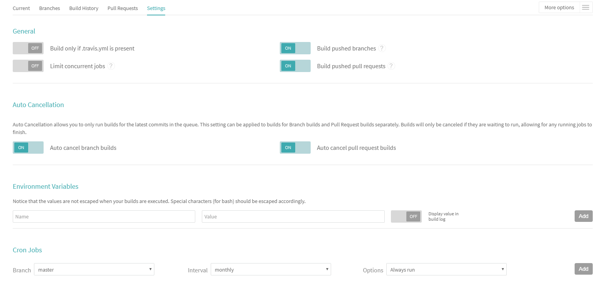
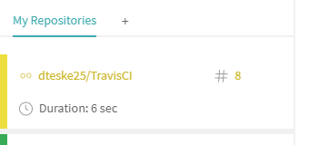
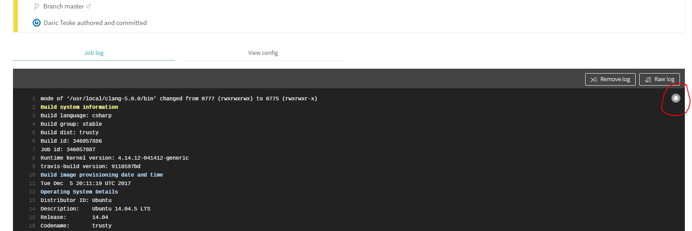
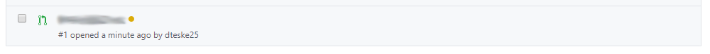
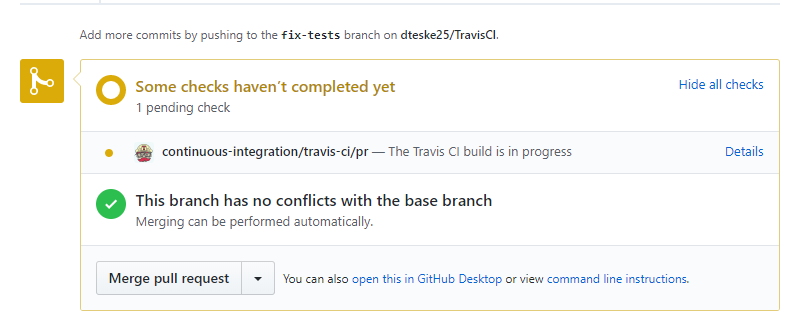
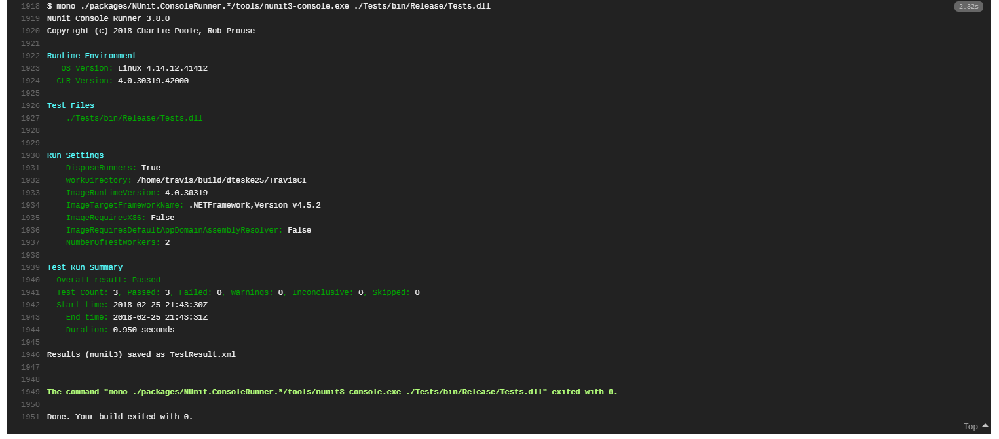
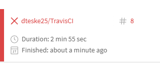
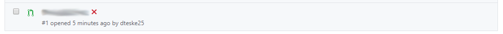
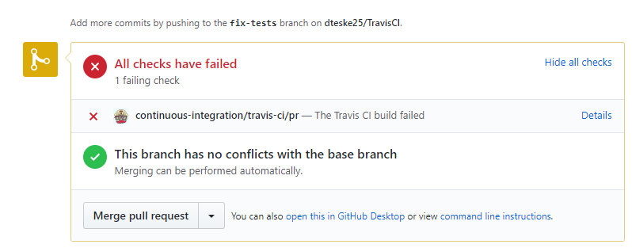
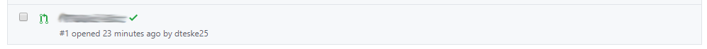

[](https://travis-ci.org/dteske25/TravisCI)

# Travis CI Lab
We are going to be setting up continuous integration today on a sample project. 
Continuous integration can be used to perfom checks on written code, making sure that unit tests always pass or that formatting is followed, and that when changes are made, they don't break other areas of the code.
Unfortunately, to set up Travis CI on a private project, you have to pay for it, so you will have to make the repository public.

Fork and clone the repo to your computer to get started.

## Run the Console App
Just as a sanity check, make sure that everything is working before you begin. Try out the console app, see if you can break it and where the weaknesses in the code are. Try manually running the tests.

## Set up Travis CI to build the Console App
- Go to [travis-ci.org](http://travis-ci.org), and sign-in with your GitHub credentials. 
- Accept the GitHub access permissions confirmation.
- Go to your profile page and enable this repository.
- Click the gear icon, and make sure the settings are as follows:



Add a `.travis.yml` file to the root folder for your project. This is your Travis config file.
> We're following the information from [this](https://docs.travis-ci.com/user/languages/csharp/) guide to set up our project.

Put the following in your Travis config:

```
language: csharp
solution: TravisCI.sln
branches:
  only:
  - master
install:
  - nuget restore TravisCI.sln
script:
  - msbuild /p:Configuration=Release TravisCI.sln
```

- Commit and push these changes to master
- Open travis-ci.org and see if your build is running. 
- A running build will look like the following in the left drawer:



You can follow along with the build log by clicking the gray circle in the upper-right of the build log:



You also might have noticed that the "build passing" badge at the top of the readme is also right here (though it might not say passing right now). To get your own link, just click that badge, and from the dropdown, select the link as markdown. It will look something similar to `[](https://travis-ci.org/username/TravisCI)`. It's really nice to have that in your readme file, so that you always know the build status of your master branch.

## Implement the Power method
Once Travis CI is up and running, it should rebuild every time you push a change, or open a pull request. Let's test this out.

- Implement the `Power` method found in `Program.cs`.
- Commit and push the change to a different branch.
- Open a pull request.
- Verify that Travis CI started building your pull request.

Travis CI is pretty well integrated into GitHub. I've got examples here showing the build statuses on the pull requests:





Once the build completes, merge your pull request with master. Verify Travis CI started building master again.

## Set up Travis CI to run Unit Tests
To run the tests after every change, we'll have to modify the Travis config slightly. 
Adjust the `script` section to be the following. 

```
script:
  - msbuild /p:Configuration=Release TravisCI.sln
  - mono ./packages/NUnit.ConsoleRunner.*/tools/nunit3-console.exe ./Tests/bin/Release/Tests.dll
```

This is the NUnit test runner, and will allow Travis CI to run the tests on the server from the command line.
Commit and push this change to master.
Open Travis and make sure the build completes.

If you've done this correctly, the following should appear at the bottom of your build log:



## Implement the other unit tests
Follow the same format as the addition unit tests, and implement tests for the rest of the operations defined in `Program.cs`.

- Run the tests locally, and intentionally make one fail.
- Commit and push the changes to a different branch.
- Open a new pull request.

Travis CI will detect the pull request, and build it. Since we have a test failing, it should detect that. A failed build will look like the following;



And in GitHub it will look like:




- Push a change on the same branch to fix the test.
- See if the build completes successfully.

In GitHub, that will look like the following:




If everything passes, feel free to merge. You are now using CI.

This is a pretty simple setup for Travis CI. There's a lot of customization that can be done, so check out https://docs.travis-ci.com/ if you're curious about how it could be used. This is a free service, so if you have a public side project, I'd encourage you to set up Travis CI on it. Even if you don't really need to use it, it's great practice.
